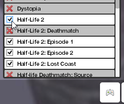

Empezando en el servidor
========================

Esta página te ayudará a entrar al servidor con las texturas necesarias además de enseñarte lo básico del modo de juego.

Contenido necesario
-------------------

Antes de acceder al servidor necesitas descargarte el contenido necesario para ver todo correctamente.

Juegos necesarios
^^^^^^^^^^^^^^^^^

Aparte de `Garry's Mod <http://store.steampowered.com/app/4000>`_, debes tener los siguientes juegos instalados:

* `Counter-Strike: Source <http://store.steampowered.com/app/240/>`_
* `Half-Life 2 <http://store.steampowered.com/app/220/>`_

Una vez instalados, monta el contenido en GMod pulsando en el icono que parece un mando de consola y seleccionando ambos juegos.

**Si no tienes uno o los dos juegos, sigue leyendo esta subsección.** En caso de que tengas los dos juegos, pasa a la parte addons necesarios.

Addons necesarios
^^^^^^^^^^^^^^^^^

