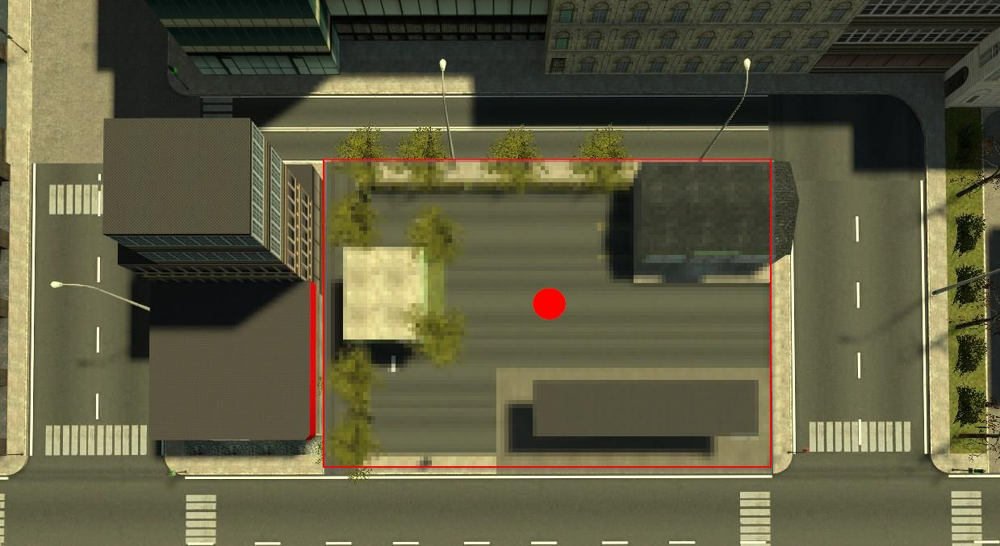

Guía para principiantes
=======================

Introducción
------------

**Bienvenido al servidor de roleplay de Hermandad Fénix**. Roleplay es una palabra inglesa, que podría traducirse como *hacer un rol*. Básicamente, se trata de actuar como lo que intentas ser: un policía, el alcalde, un guardia de seguridad... Esta guía te enseñará lo básico para empezar a *rolear* en nuestro servidor, con el modo de juego de DarkRP. 

Tu personaje
------------
Cuando entres por primera vez al servidor serás un simple ciudadano, con tu nombre de steam.

Nombre
^^^^^^
Tu nombre de personaje puede o no ser el mismo que uses en Steam, aunque te recomendamos (y te pedimos por favor) que te pongas uno adecuado para el rol que vayas a realizar. Los nombres no podrán contener caracteres difíciles de escribir (por ejemplo $, [], (), ¿? y demás símbolos), tampoco podrán ser ofensivos ni demasiado largos. *Juan Martínez* (Nombre Apellido) es un buen nombre de rol, ya que es fácil de recordar, y encima es como un nombre en la vida real. *$XxXxTEHWiLlYrExXxX$2001* no es un buen nombe. Tampoco es un buen nombre Grúa, Puerta, etc.

Para cambiarte el nombre usa el comando de chat ::

	/rpname nombre

Trabajo
^^^^^^^
Tu trabajo es un indicador de lo que haces. Puedes seleccionar el trabajo que desees realizar pulsando *F4* y a continuación el trabajo que quieras.

Además, si quieres editar la información que aparece a los demás encima de tu cabeza para por ejemplo ponerles más fácil entender que eres un panadero en vez de un chef o un entrevistador en lugar de locutor de radio, puedes usar el siguiente comando: ::

    /job trabajo

Por favor, ten en cuenta que esto no te da derecho a ponerte el trabajo que quieras: se usa sólo para pequeñas ediciones a tu job actual. Tampoco puedes ponerte tonterías o cosas para intentar hacer gracia como por ejemplo *Doraemon* o *Unidad de SWAG*. 

Todo el mundo es ciudadano a primera vista excepto los chefs, paramédicos, policía, alcalde y demás trabajos de uniforme exceptuando banda y mafia. Si ves a un asesino a sueldo acercarse no le paras porque es un asesino a sueldo. Tampoco debes chequear las armas a todo mafioso que veas por la ciudad: para ti, son ciudadanos normales y corrientes.

Conceptos básicos del rol
-------------------------

NLR
^^^
Existe una norma que dice que al morir, inicias una vida nueva. Esta es una de las normas más importantes y con mayor influencia sin ninguna duda. 

NLR, del inglés *New Life Rule*, es una norma que más o menos dice que cuando mueres, y aunque te reviva un paramédico, tu personaje, al volver a aparecer te *olvidarás* de todo lo ocurrido en tu *anterior* vida. Esto incluye cosas como quién te ha matado, dónde había printers o quién te ha robado en tu tienda. Si mueres como policía, al respawnear serás un nuevo policía, y así con los demás trabajos.

Además de todo esto, al morir no podrás volver a la zona de tu muerte durante 5 minutos como mínimo, tampoco podrás respawnear tu coche durante ese tiempo.

RDM
^^^
Hay algo que es también importante y que es inprescindible saber acerca de él: el RDM. RDM viene del inglés y significa *Random DeathMatch*. 

Traducido, pódría significar pelea sin razón o al azar, y no está permitido. Vamos, que no puedes hacer daño a otros jugadores porque sí o sin razón. 
Necesitas una razón de mucho peso para hacer daño a los demás, como en la vida real. No puedes disparar a alguien por no hacerte caso en tu tienda: deberás llamar a la policía o contratar a un guardia de seguridad. Como policía no puedes por ejemplo disparar a alguien que se ha saltado un semáforo: le pones una multa o en casos extremos le arrestas.
Si dudas antes de hacer daño a los demás, piensa en si les harías daño en la vida real por lo que han hecho, y la respuesta será generalmente no.

FailRP
^^^^^^
FailRP puede significar en inglés *Fail to Roleplay*, que traducido sería fallar roleando o no rolear bien.

Esto significa que lo que has hecho no está permitido por las normas de rol, que simplemente no está roleando, o es demasiado poco realista haciéndolo. 
Por ejemplo, como chef asaltar el ayuntamiento, o como policía matar al alcalde. 

Existen diferentes grados de FailRP, algunos hacen que los demás jugadores roleen peor o lo pasen peor: por ejemplo ponerse a molestar gritando por micrófono o ponerse a saltar por ahí mientras corres con pa physics gun y algunos que harán que acabes baneado. Intenta siempre hacer las cosas como las harás en la vida real siguiendo las normas.

Carkill
^^^^^^^
Los coches son muy importantes en el servidor. Hay muchos coches disponibles para comprar, cada uno con su potencia y velocidad.

Carkill significa en español matar con el coche, y en general no deberías poder matar a otras personas intencionadamente con el coche. Si eres un viandante, debes ir por la acera y no por la carretera para evitar problemas. Si eres un conductor, nunca atropelles a alguien en la acera ya que está prohibido por norma. Cuando atropelles a alguien, que no te extrañe si te arrestan, ya que debes conducir con cuidado. Otra cosa es que los peatones salten a la vía, que sería FailRP, pero tú siempre frena cuando veas a alguien. En resumen: no te pases con la velocidad del coche para evitar problemas, frena si hay alguien en la carretera y conduce bien en general para evitar problemas.

IC y OOC
^^^^^^^^
Otra cosa importante es saber diferenciar entre **IC** (Dentro de tu personaje) y **OOC** (Fuera de tu personaje). 

Esto significa que no puedes usar información OOC para tu personaje, IC. A continuación te dejamos unos ejemplos de lo que no se puede hacer:

* No puedes hablar como tu personaje por el chat OOC pidiendo un arma, una pizza y demás
* No puedes poner un /advert 
* No puedes pedir un chef por OOC
* No puedes avisar de un robo por ooc, ni decir que no pagarás el rescate

Ejemplos de buena diferenciación de IC/OOC:

* Preguntar dudas por OOC
* Anunciar nueva tienda por /advert
* Dar órdenes como líder por chat de grupo
* Hablar de temas fuera de rol por OOC

*Puedes hablar por el chat global OOC precediendo tu mensaje con dos barras (//)*

Metagaming
^^^^^^^^^^
Si usas el chat OOC para decir cosas IC se considera Metagaming, al igual que tratar diferente a alguien porque leas que es por ejemplo *Asesino a sueldo*. Tampoco puedes servirte del feed de muertes para saber que han matado a alguien, y tampoco puedes usarlo para saber quién. Si por ejemplo ves un /me que dice: Saca 500€ de una printer azul, no puedes usarlo como policía como razón para entrar ya que no has visto la printer.

Funcionamiento del servidor
---------------------------

El rol está *situado* en una ciudad ficticia llamada **Evocity**. Evocity es todo el mapa. El ayuntamiento (también llamado nexus) que aparte de ser el edificio más grande y alto de todo Evocity, es el lugar desde donde el alcalde gobierna la ciudad controlando a la policía, manejando la economía (pone las tasas), poniendo las leyes y decretando toques de queda. La policía y el SWAT (una unidad especial que se encarga de asaltos y del nexus) tienen ahí la comisaría, donde guardan sus coches y está la prisión. Para terminar con el gobierno, están los paramédicos: se dedican a ofrecer primeros auxilios y a reanimar con su desfibrilador.

Luego están los ciudadanos, que pueden dedicarse a la venta de comida, armamento, material ilegal, pueden alquilar habitaciones del hotel, guardar printers en el banco o simplemente no hacer nada y mendigar.

Para terminar, están los asesinos a sueldo y las bandas organizadas, que son la base del crimen organizado. Te secuestrarán, robarán o incluso se atreverán a asaltarán al alcalde a la mínima muestra de intención de tornar su mandato en una dictadura o si sus leyes son muy duras. 

Teclas
^^^^^^

* Mantén pulsada la "**R**" para abrir el teléfono. Puedes cambiarlo en los ajustes.
* Pulsa "**Y**" para hablar por chat normal
* Pulsa "**U**" para hablar por chat de grupo
* Pulsa "**F1**" para abrir la página de ayuda y la lista de comandos
* Pulsa "**F4**"" para abrir el panel de jobs y de compra de objetos

Comandos
^^^^^^^^
Para realizar algunas acciones en el servidor es necesario usar comandos. A continuación te dejamos una lista de los más sencillos y/o más utilizados.

* ``/advert`` Como si publicas un anuncio en el periódico.  Ejemplo: /me nueva tienda de lavadoras en la ciudad
* ``/me acción`` Realizas una acción.  Ejemplo: /me guarda el dinero
* ``/channel número``  Selecciona la frecuencia de radio que usas
* ``/radio mensaje``  Habla por la frecuencia de radio que has seleccionado
* ``/cheque usuario cantidad``  Extiende un cheque de manera que sólo el usuario pueda recogerlo
* ``/cr mensaje``  Manda un mensaje a la policía (como llamar al 112)
* ``/dropmoney cantidad``  Tira dinero al suelo
* ``/give cantidad``  Da dinero a la persona a la que miras
* ``/job trabajo``  Cambia el nombre a mostrar de tu trabajo
* ``/rpname nombre``  Cambia tu nombre a mostrar
* ``/requestlicense``  Pide una licencia a la persona a la que miras
* ``/sleep``  Duermes. Cuidado: sancionable si se abusa
* ``/title título``  Ponle título a una puerta
* ``/write mensaje``  Escribe un mensaje en un papel
* ``/y mensaje``  Grita un mensaje
* ``/w mensaje``  Susurra un mensaje
* ``/removeletters``  Elimina todos los papeles que has escrito
* ``/unownalldoors``  Vende todas tus puertas y vehículos
* ``/afk``  Cambia entre modo AFK y no AFK. Aviso: No debe usarse para desbuguearse o para cualquier otro fin que no sea marcar que estamos ausentes por un rato largo. 

