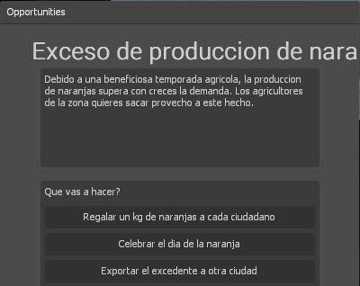
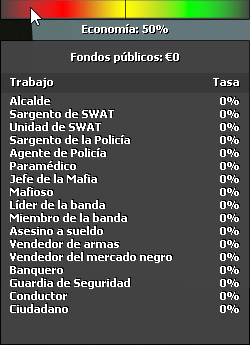
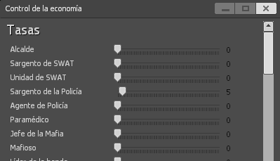
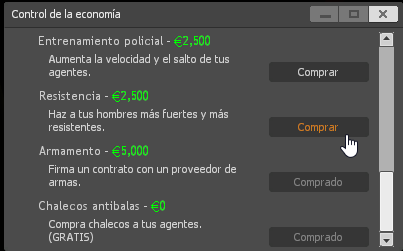
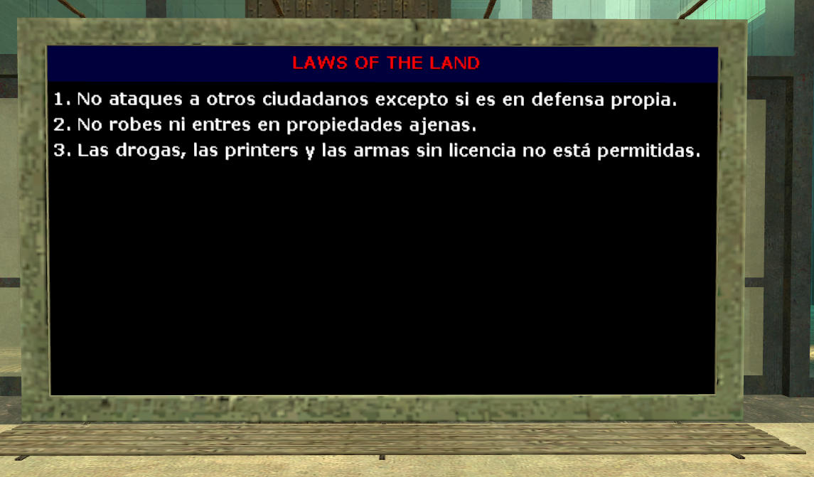
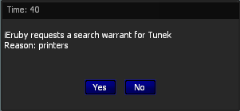

Alcalde
=======

Como alcalde, tu misión es gobernar la ciudad.

Economía
--------

Como alcalde, eres el único responsable de la economía de Evocity.

Oportunidades
^^^^^^^^^^^^^

Cada cierto tiempo se te aparecerán diferentes historias con posibles soluciones.  
Una de ellas es la correcta, las otras dos no lo son. Usando tu sentido común debes responder la que más adecuada te parezca.  
Si resulta ser la correcta, la economía podrá subir un porcentaje determinado, y es posible que se añada dinero a las arcas públicas.

Fondos públicos
^^^^^^^^^^^^^^^

Puedes consultar el dinero disponible pasando el ratón (pulsa F3) por el indicador de economía.

Cuando respondas una pregunta bien, puede que se añada algo de dinero a los fondos públicos. Puedes usar este dinero para comprar perks a los agentes de policía.

Cuando toca pagar a los ciudadanos, se retira dinero de los fondos.

Impuestos
^^^^^^^^^

Accede al menú del alcalde pulsando F2. Desde ahí puedes controlar el porcentaje que el estado se queda del salario de la gente. No olvides pulsar el botón *Actualizar tasas* para que se guarden.

Perks
^^^^^

Las perks son mejoras que el alcalde puede comprar a sus agentes de policía a cambio de dinero de los fondos públicos.

Hay cuatro perks:

* Entrenamiento policial  
  * Permite a tus agentes entrenarse para saltar y correr más rápido
  * Coste: 2.500€
* Resistencia  
  * Permite a tus agentes seleccionar una mejora en su resistencia al daño
  * Coste: 2.500€
* Armamento
  * Permite a tus agentes seleccionar armas más avanzadas:
    * Agente de policía: M4A1, MP5A5.
    * Sargento de policía: M4A1, MP5A5, M3 Super 90.
    * Unidad de SWAT: M4A1, M3 Super 90.
    * Sargento de SWAT: M4A1, MP5A5, M82.
  * Coste: 5.000€
* Chalecos antibalas
  * Permite a tus agentes equiparse con chaleco
  * Coste: 0€

Leyes
-----

El alcalde es el único que puede editar las leyes de Evocity.

Para hacerlo, debes colocar en un lugar visible (como por ejemplo encima de las puertas del nexus) el panel con las leyes.  
Para ello, escribe ``/placelaws``. Esto te dará el panel con las leyes.

Para añadir leyes, escribe ``/addlaw ley``.  
Para eliminar leyes, escribe ``/removelaw numero de la ley``

Lockdown
--------

Como alcalde, eres el único que puede poner en marcha un toque de queda.  
Para hacerlo, escribe ``/lockdown``.  
Acto seguido, debes explicar la razón del lockdown a través de un comunicado. (``/broadcast comunicado``)  
Los toques de queda pueden tener una duración máxima de 5 minutos, siempre y cuando no se esté asaltando el nexus.  
Cuando el toque de queda haya acabado, escribe ``/unlockdown``.

Warrants y wanted
-----------------

Warrants
^^^^^^^^

Un warrant es una orden de registro.
Todas las órdenes de registro pasan por el alcalde para ser aprobadas.

De vez en cuando, te llegará algo como esto:

Decide si quieres aceptar o no y selecciona la opción correspondiente.

Si quieres ordenar una orden de registro directamente, escribe ``/warrant usuario razón``.  
No tendrás que aprobarlo, ya que eres tú el que lo ordena.

Wanted
^^^^^^

Puedes poner a otros usuarios en busca y captura al igual que la policía.

Para ello, escribe ``/wanted usuario razón``.  
Si quitar el wanted, escribe ``/unwanted usuario``.
