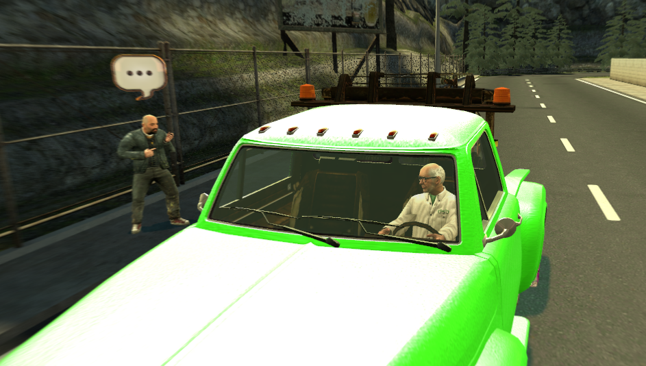
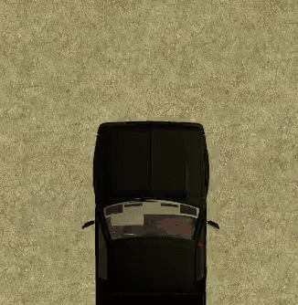
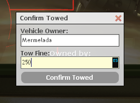

Gruista
=======

Como gruista debes retirar los coches mal aparcados y ponerles una multa, para que así el tráfico sea más fluido. También podrás llevarte coches rotos a tu garaje si estaban mal aparcados.

Tienes a tu disposición dos herramientas de gruista: la llave inglesa, que sirve para reparar coches y el *Tower Equipment*, que puedes usar para enganchar coches a tu grúa además de para poner multas.

Para sacar la grúa, habla con un NPC cerca de tu spawn con un bocadillo sobre su cabeza. Selecciona *Retrieve truck* para spawnear el vehículo justo delante.

Requisar coches
---------------
Cuando veas un coche mal aparcado dentro del centro de la ciudad (si es fuera del centro, mientras no esté en medio de la carretera tampoco importa demasiado), puedes llevártelo a tu depósito de vehículos (no puedes ponerle multa y marcharte, dejándolo mal aparcado).

Para enganchar un coche a la parte de atrás de tu grúa, debes poner la parte trasera de tu grúa pegada al morro del vehículo que quieras requisar. Entonces, sin bajarte siquiera, puedes hacer clic derecho y si todo está bien se enganchará a la grúa.

Cuando hagas esto, no te olvides de poner inmediatamente el advert para evitar que respawneen el vehículo que has requisado.

Ejemplo: */advert Don/Doña Mermelada, su coche ha sido retirado y multado por la grúa por estar mal aparcado. Depósito en la zona industrial.*

Hecho esto, debes dirigirte a un lugar donde dejes todos los coches que requises, y dejarlo más o menos aparcado bien.

Recuerda que los coches de policía o SWAT no pueden ser retirados ni multados. Si las ambulancias están mal aparcadas y no es por una emergencia, apárcalas bien pero sin poner multa. Haz caso a las indicaciones de la policía y del alcalde en todo momento: si te mandan ir a por un coche, es tu máxima prioridad.

Poner multas
------------
Como gruista, puedes poner multas a los coches que te hayas llevado o hayas arreglado, siempre avisando por advert.

Para ponerlas, basta con que hagas clic derecho sobre el coche una vez estés en el depósito. Pon la cantidad (máximo 500) y pulsa el botón.

Ejemplo: */advert Don/Doña Mermelada, su coche ha sido retirado y multado por la grúa por estar mal aparcado. Depósito en la zona industrial.*

Arreglar coches
---------------
Si ves un coche roto, puedes ofrecerte a repararlo por un precio. 
Tú decides si ponerle multa al coche o pedir el dinero en efectivo.
Si te has llevado un coche mal aparcado y encima roto, considera el arreglarlo gratis (o súbele la multa si quieres) para evitar que tenga que andar más.  

Para arreglar un coche, simplemente tienes que darle mientras estás pegado al mismo con la *Llave inglesa*. Ten en cuenta que los coches tienen mucha vida: tendrás que seguir dándole aunque el humo haya cesado.

