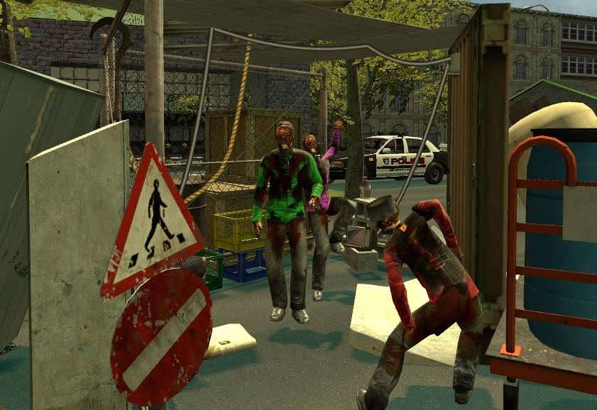

Mendigo
=======

Como mendigo, eres lo más bajo de la sociedad de Evocity. No tienes casa, coche ni dinero.

Puedes pedir dinero o no: depende de ti completamente. Además, sólo puedes usar un triciclo para moverte por la ciudad. Lo puedes comprar por 50€.

No puedes poner printers, anuncios, macetas, etc. (Si te han robado las printers o ya tienes, espera a que exploten para ponerte) Y puesto que no tienes dinero, no puedes tampoco gastarte más que lo mínimo en comida: nada de langostas ni pizzas enteras. Ese lujo no es para un mendigo.

Que seas mendigo no te da derecho a molestar al resto. No pegues a la gente que no te quiera dar dinero. Tampoco te montes una banda de mendigos revolucionarios que molesten a la policía. Recuerda que no puedes llevar armas ni contratar asesinos a sueldo.

Casa en la calle
----------------
Como mendigo, puedes hacerte una *casa* en la calle. La casa debe ser sencilla, típica de un mendigo (una chapuza con todo lo que hay en los contenedores), sin botones ni keypads ni otros mecanismos, y no debe bloquear la carretera ni acceso a propiedades o demás. 

Si el alcalde te dice que quites tu casa, quítala inmediatamente. 