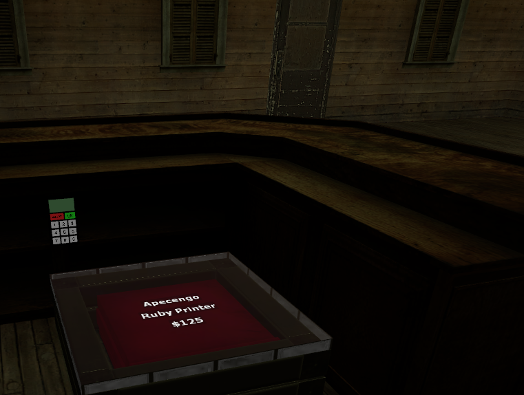

Policía
=======

Introducción
------------
La policía es la base de la seguridad y estabilidad de Evocity. Se encarga de hacer cumplir la ley y de proteger a los ciudadanos.

Pueden solicitar órdenes de registro al alcalde, poner a gente en busca y captura y detenerles o retenerles.

Para ello, van armados, tienen un taser y esposas, además de herramientas que les permiten arrestar y desarrestar.

Esta es una guía que intenta explicar qué hacer y cómo actuar en las situaciones más comunes.

Primeros pasos
--------------
Nada más unirte al cuerpo de policía te aparecerá una ventana en la que según las perks que el alcalde haya comprado podrás elegir si ponerte chaleco, subirte la velocidad, la resistencia o incluso equiparte con mejores armas.

.. image:: ../img/policiaspawn.png

Selecciona dónde quieres invertir los puntos de selección, las armas con las que quieres spawnear y luego pulsa en *Terminar*.

A continuación, saca tu *Glock-20* y recárgala. Pulsando **"C"** puedes seleccionar también una mejora gratuita que te permitirá apuntar mejor con poca luz.

Recuerda que puedes abrir la radio del gobierno para escribir mensajes pulsando **"U"**. 

Ahora que eres un nuevo agente, preséntate por radio y pide órdenes. Por ejemplo: *Agente López disponible, esperando órdenes.* A continuación el sargento de la policía te dirá lo que hacer.

Echa un vistazo a la agenda del gobierno para enterarte de las tareas actuales y además saber las contraseñas. 

Antes de bajar, comprueba que las celdas estén cerradas. Luego, llama al ascensor y baja al piso que da a la calle. Busca las leyes si hay alcalde (pregunta a algún compañero sin miedo por su posición) y apréndetelas.

Acto seguido, ve a por tu coche a la gasolinera y apárcalo en el garaje o en alguna plaza de aparcamiento. (Por favor, no lo dejes por ahí mal aparcado o en doble fila)

Recomendamos patrullar siempre en parejas como mínimo ya que es más seguro y permite a un agente comunicar lo ocurrido mientras por ejemplo se persigue en coche a un infractor.

Conceptos básicos
-----------------
Wanted o En busca y captura
^^^^^^^^^^^^^^^^^^^^^^^^^^^

Si un usuario está wanted, significa que le busca la policía por la razón que sea. es fácilmente identificable porque su nombre y la razón del wanted es visible desde muy lejos, obligándole a tener que esconderse. Cuando alguien está wanted, normalmente significa que debe ser arrestado salvo que se indique lo contrario en la razón, por ejemplo: Citación judicial, Multa pendiente, Necesita licencia, etc. En esos casos, lo normal sería llevarle a comsiaría.

Warrant u Orden de registro
^^^^^^^^^^^^^^^^^^^^^^^^^^^
Un warrant (orden de registro en inglés) es el permiso que da derecho a la policía a hacer una búsqueda en el local o propiedad de un ciudadano. Si hay alcalde, debe ser aprobado por él.
Ejemplos de razones son: Fugitivo en la propiedad, Manejo de printers ilegales dentro, Disparos en el interior, etc.

Sólo puedes poner warrants por motivos por los que estés muy seguros: por ejemplo, en caso de printers no podrás entrar a menos que las hayas visto, visto explotar u oído y estés seguro de que es en esa propiedad. Para entrar a una propiedad, necesitas una orden de registro, pero hay excepciones, como cuando entras a la parte pública te una tienda que esté abierta o cuando te llaman a un cr y la puerta está abierta (ej. me roban en mi casa en los apartamentos).

Sólo puedes usar el Battering Bam o, en caso de que sea estrictamente necesario, el keypad cracker para acceder a una propiedad.

Lockdown
^^^^^^^^
Lockdown significa toque de queda. Esto quiere decir que todos los ciudadanos deben despejar la calle. Si ves alguno que sigue a pesar de los avisos de la policía, arréstale.

Printer
^^^^^^^

Una printer es un aparato ilegal (siempre que esté fuera del banco) que fabrica dinero. Son fácilmente identificables por su sonido de impresora antigua y también por su explosión si se sobrecalientan.

Existen dos tipos: rojas y azules. Se suelen guardar en cajas, en el fondo de las tiendas. 

Herramientas
------------
**Stun stick:** la porra de policía. Úsala para controlar a la gente en situaciones más peligrosas. Con clic izquierdo, pegas un pequeño golpe de aviso y aturdes. Con clic derecho, pegas un golpe fuerte que incluso hace daño además de aturdir. Pulsando la tecla **"R"** la levantas, avisando.

**Glock-20:** El arma oficial y más básica de la policía. Sólo deberá ser usada en situaciones donde la vida del agente o la de otro ciudadano están en peligro. En la policía no existen los tiros de aviso, cuando se dispara, se dispara a matar, no para asustar. El arma no puede estar desenfundada salvo para situaciones de peligro. Existen excepciones acerca de cuándo se puede disparar a civiles.

**Taser:** Usarás este arma la que más. Dispara una bala que se clava en el cuerpo y suministra una descarga que incapacita al sujeto durante un corto periodo de tiempo. Puedes usarlo contra personas que se nieguen a colaborar mientras son arrestadas, si intentan huir o si agreden a otro ciudadano o policía con los puños. No tasees nunca a un ciudadano que por ejemplo te ha insultado pero no ha huído, etc. 

.. note:: No arrestes a gente mientras esté taseada. Esto les bugueará y tendrás que llamar a un administrador para desbuguearles.

**Arrest baton:** usa esta herramienta para arrestar a una persona tras haberle leído sus derechos y haberle explicado claramente la razón por la que es detenido. Para detener a alguien, ponle las esposas primero. Estará 240 segundos en la cárcel. Sólo puedes arrestar a gente que esté siendo buscada por la policía (wanted)

**Unarrest baton:** esta herramienta sirve para desarrestar a alguien. Basta con que le golpees con ella.

**Weapon checker:** este es el equivalente a hacer un cacheo a otra persona en la vida real. Tiene tres funciones: con clic izquierdo haces un cacheo rápido, con clic derecho le quitas las armas ilegales (siempre y cuando se esté quieto) y con la r le devuelves sus armas. Ten en cuenta que antes de cachear, la persona debe ponerse contra una pared y por supuesto debes de haberle avisado. No puedes ir cacheando por ahí sin más.

**Hand Cuffs:** las esposas. Esposa con clic izquierdo, desesposa con clic derecho. Cuando vayas a arrestar o retener a alguien, debes esposarle por seguridad. No puedes esposar por ejemplo para permitir a alguien entrar al nexus, o porque te ha insultado. Sólo para arrestar o trasladar personas retenidas.

**Lockpick:** sirve para forzar cerraduras, aunque no debe usarse para abrir propiedades con o sin orden de registro.

**Battering Bam:** ariete para *tirar abajo* (abrir) puertas de propiedades con orden de registro . Cuando hayas solicitado una orden, haz clic derecho para cargarlo y a continuación izquierdo pegado a la puerta que quieres abrir para abrirla, o si es una fading door para abrirla temporalmente. También sirve para echar a la gente de su vehículo, impidiéndoles por norma volver a montarse hasta que les des tu el OK o que haya pasado un rato. Esto cerrará el vehículo.

*Puedes comprar munición para tu pistola exclusivamente a través del menú del F4*

Comandos
--------

* ``/wanted usuario razón`` pone al usuario en cuestión en busca y captura. Será fácilmente identificable por la policía. Es necesario para detener a alguien.
* ``/unwanted usuario razón`` quita a alguien de la lista de personas en busca y captura.
* ``/warrant usuario razón`` solicita orden de registro a la propiedad de una persona por la razón indicada. Si hay alcalde, tendrá que aceptarla.
* ``/channel número`` establece el canal de radio por el que se mandarán los mensajes. 
* ``/radio mensaje`` manda un mensaje por el canal de radio que hayas establecido. (No es lo mismo que el chat de grupo del gobierno, aunque a veces lo llamemos radio)

*Para nombres con un espacio de por medio, pon sólo una parte o saldrá el nombre en la razón*

Procedimientos
--------------
En esta sección intentamos enseñar la manera correcta de actuar en situaciones que pueden ocurrirte como policía.

Arrestar a alguien
^^^^^^^^^^^^^^^^^^
LLegará el momento en el que quieras arrestar a alguien. Cuando eso pase, ten en cuenta lo siguiente:

* ¿Tiene arma desenfundada? En caso afirmativo, deberás usar fuerza letal para neutralizarle si no obedece ya que no puedes esposarle ni tasearle.
* Si no tiene arma desenfundada, ordena al ciudadano ponerse cara a la pared más próxima, o en caso de no haber, ordénale girarse de espaldas a tu cara.

Una vez esposado , habla con él para dale oportunidad de explicarse y de evitar una detención innecesaria ya que a lo mejor lo que ha hecho no es tan grave y se le puede dejar en una multa o igual lo que ha hecho ya no es ilegal.

Si no obedece, tasea avisando con algo como por ejemplo: *le voy a tener que tasear ya que está resistiéndose, señor/a*. Si continúa sin obedecer, le intentas poner las esposas, el wanted y le arrestas.

Si se muestra colaborativo y quieres detenerle, procede a leerle sus derechos, como por ejemplo: *tiene derecho a guardar silencio, tiene derecho a un abogado, si no tiene dinero se le asignará uno de oficio* o lo que se te ocurra en el momento. Dicho esto ponle un wanted serio, con buena ortografía y bien escrito (ej. Allanamiento de propiedad ajena, Robo de vehículo, Intento de homicidio...), saca el *Arrest baton* y haz clic izquierdo sobre el detenido.

Warrant por printers
^^^^^^^^^^^^^^^^^^^^
Las printers son muy populares entre los ciudadanos, la cosa es que fuera del banco son ilegales. Cuando estés patrullando oirás explosiones: esas explosiones son de printers. Las printers son aparatos que imprimen dinero, por lo tanto hacen un ruido muy característico. Se escucha a veces incluso a través de paredes. Las printers que estén fuera del banco son consideradas ilegales. La cosa es que muchas personas prefieren guardar las printers por ahí en lugar de en el banco (de hecho, el banco acaba siendo exclusivamente para el gobienro ya que nadie más mete) ya que este puede cobrarles por dejarlas, o simplemente quieren tenerlas en su base. 

Imagínate que pasas por el bar de carretera cuando de repente se escucha una explosión. Puesto que no hay edificios cercanos, es seguro suponer que la explosión ha venido de dentro. En caso de que sea en la ciudad u otra parte y que no estés seguro de dónde, puedes intentar pegar la oreja para ver si escuchas algo. Salvo que veas la printer o escuches claramente que hay printers dentro, no puedes entrar a otra propiedad. No puedes ir por ahí registrando propiedades a ver si hay suerte.

Una vez confirmado que hay printers dentro debes pedir refuerzos ya que puede haber gente armada dentro. Para ello, debes alejarte primero de donde hay printers para que el dueño no sospeche y a continuación debes pedir refuerzos por grupo (ej. A todas las unidades printers escuchadas en el bar de carretera, solicito refuerzos inmediatamente y apoyo del SWAT). Espera a que lleguen los refuerzos y deja al SWAT ir delante ya que ellos van mejor armados y se dedican a los asaltos. Una vez dentro, dispara a cualquiera que tenga arma desenfundada. Acto seguido, pon las esposas (siguiendo el procedimiento de arresto) a todo el que no lleve arma. Busca las printers por toda la propiedad. Guíate por el sonido.

Una vez encuentres las printers, verás que normalmente están protegidas por una especie de caja. Busca el prop que se abre con el Battering Bam y ábrelo. Pon en busca y captura a la persona que pone que es el dueño de la printer (ej. Tenencia ilícita de printers ilegales). Luego sácala y rómpela con el Stun stick.

Puedes también detener a los que estaban en la propiedad si consideras que sabían que tenían printers dentro y no han dado aviso a la policía. (ej. Complicidad en la tenencia de printers ilícitas)

Asalto al nexus
^^^^^^^^^^^^^^^
De repente aparece una noticia en el periódico: ¡están asaltando el ayuntamiento! Ya sea porque no están de acuerdo con la gestión del alcalde o por las tasas altas, una banda armada muy peligrosa ha decidido asaltar el nexus. 

Lo primero que debes hacer es conseguir que el alcalde declare un toque de queda. Acto seguido, comunícate por radio con el grupo. Lo más importante es no ir directamente al ayuntamiento.
Lo más seguro es que haya gente por fuera, esperando para disparar policías en cuanto los vea. En su lugar, estableced un puesto de mando en algún lugar seguro. Por ejemplo, puedes mandar un agente a ver la situación por si hubiera asaltantes todavía esperando para disparar a la policía. Luego, acercaos todos a la vez en coche al ayuntamiento, de esa manera evitaréis ser disparados mientras llegáis. Salid del coche (no todos a la vez u os buguearéis y os quedaréis indefensos), desenfundad, recargad y coged munición. Luego, entrad al ayuntamiento dejando a un par de agentes fuera, para controlar que ningún ciudadano pase.

Entonces, id subiendo poco a poco en el nexus, limpiando las plantas una a una. El nexus tiene, sin contar el garaje, cuatro plantas en total. Cuando lleguéis arriba, si el SWAT no ha podido encargarse de los asaltantes, tendréis que disparar a todo aquel que tenga un arma desenfundada. Pero cuidado: pueden tener al alcalde secuestrado. En ese caso, sigue la guía de secuestros.

Si todo ha ido bien, baja poco a poco limpiando otra vez los pisos despacio. Luego, al bajar al piso 0, asegúrate de que los asaltantes no han huído. Si lo han hecho, sígueles. 

Al terminar, pide al alcalde que quite el lockdown una vez se publique que ha terminado el asalto en el periódico. (Los asaltantes pondrán un advert diciendo *Asalto finalizado*)

*A veces, el asalto  no es para secuestrar al alcalde sino para abrir las celdas para sacar a alguien. Comprueba siempre si las celdas están abiertas al finalizar un asalto.*

Ten en cuenta que cuando te matan mientras se está cometiendo un asalto, no puedes volver a participar en él. Cuando eso ocurra, debes salir con la physics gun en mano lo más rápido posible, sin molestar a la policía ni los asaltantes. Recuerda también que los muertos no hablan.