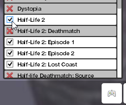
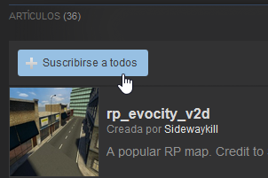
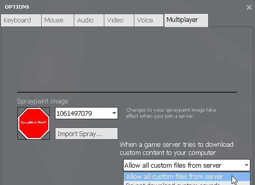

Texturas
========

Esta página te ayudará a entrar al servidor con las texturas necesarias.

Juegos necesarios
-----------------

Aparte de `Garry's Mod <http://store.steampowered.com/app/4000>`_, debes tener los siguientes juegos instalados:

* `Counter-Strike: Source <http://store.steampowered.com/app/240/>`_
* `Half-Life 2 <http://store.steampowered.com/app/220/>`_

Una vez instalados, monta el contenido en GMod pulsando en el icono que parece un mando de consola y seleccionando ambos juegos.

**Si no tienes uno o los dos juegos, sigue leyendo esta parte.** En caso de que tengas los dos juegos, pasa a la parte addons necesarios.

Descargar contenido sin tener los juegos
^^^^^^^^^^^^^^^^^^^^^^^^^^^^^^^^^^^^^^^^

El procedimiento es el mismo para los dos juegos, en el ejemplo usaremos Counter-Strike: Source.

**1. Accedemos a la siguiente página: `enlace a la página`_**

**2. Buscamos donde pone el nombre del juego** (en este caso Counter-Strike: Source) y pulsamos en el botón que pone *Game Content* junto a un servidor de descarga. *(recomendamos MEGA)*

**3. Accedemos a la carpera de addons de GMod**
En Windows puede estar en: ::

    C:\Program Files (x86)\Steam\SteamApps\common\GarrysMod\garrysmod

**4. Descomprimimos el archivo descargado dentro de la carpeta addons**
Asegúrate de que cuando entres a la carpeta no haya otra con el mismo nombre dentro, debe quedar así más o menos:

**5. Repetir el proceso** con el otro juego, si no lo tenemos instalado.

.. _enlace a la página: http://kajar9.wix.com/cscheater2/#!downloads/chgd

Addons necesarios
-----------------

Aparte de los juegos, necesitas una serie de texturas extras para ver algunas cosas como las armas, los coches y demás.

**1. Accede a `esta colección`_** e inicia sesión en Steam.

**2. Haz clic en donde pone *Suscribirse a todos*.**

**3. Abre GMod y espera a que las descargas finalicen.**

.. note:: Cuando añadamos cosas al servidor, deberás volver a pulsar el botón para descargar el nuevo contenido.

Este paso es importante porque que reducirá mucho el tiempo de acceso al servidor, ya que el servidor no tendrá que descargarte cada vez los addons.

.. _esta colección: http://steamcommunity.com/sharedfiles/filedetails/?id=280193103

Activar descargas
-----------------

Hay una serie de cosas que no están disponible sen la workshop y que descargarás directamente de nuestros servidores. 
Para ello, debes activar la opción que le permita al servidor hacerlo.

**1. Abre el juego.**

**2. Abre las opciones.**

**3. Selecciona la pestaña multijugador.**

**4. Activa las descargas** seleccionando la primera opción que diga *Activar todas los archivos del servidor* o algo parecido.

